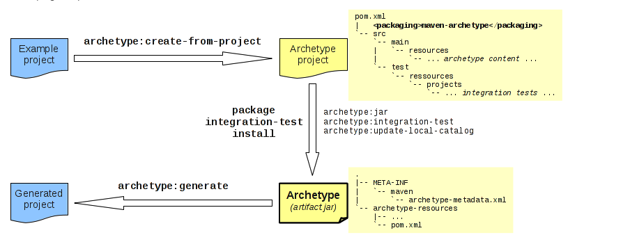

# archetype plugin
maven项目搭建骨架



# 功能
## 根据archetype骨架快速搭建新项目

##也可以从已有项目中生成archetype骨架

#archetype4大使用目标
>The archetype plugin has four goals for direct use:<br/>
 archetype:generate creates a Maven project from an archetype: asks the user to choose an archetype from the archetype catalog, and retrieves it from the remote repository. Once retrieved, it is processed to create a working Maven project.<br/>
 archetype:create-from-project creates an archetype from an existing project.<br/>
 archetype:crawl search a repository for archetypes and updates a catalog.<br/>
 and three goals bound to default lifecycle by 'maven-archetype' packaging:<br/>
 archetype:jar (bound to the package phase) is used to build the archetype jar artifact.<br/>
 archetype:integration-test (bound to the integration-test phase) is used to execute archetype integration tests by generating sample projects from the just built archetype.<br/>
 archetype:update-local-catalog (bound to the install phase) is used to update the local catalog.<br/>

# archetype创建新项目生命周期
* 1.用户选择一个想生成的archetype骨架
* 2.配置需要的属性(groupId,artifactId,version,package)以及额外自定义的属性
* 3.新项目生成

# 实验
## 1.从已有archetype骨架中创建新项目
一般archetype来源于远程仓库
>mvn archetype:generate

### 1.2过滤
过滤功能,archetype太多了,groupId包含"org.apache"和artifactId包含"spring-boot"(熟悉的情况下推荐)
>mvn archetype:generate -Dfilter=org.apache:spring-boot
```
chujun@chujundeMacBook-Pro  ~/my/project/my/archetype  mvn archetype:generate -Dfilter=org.apache:spring-boot
[WARNING]
[WARNING] Some problems were encountered while building the effective settings
[WARNING] Unrecognised tag: 'properties' (position: START_TAG seen ...</snapshots>\r\n            <properties>... @342:25)  @ /Users/chujun/.m2/settings.xml, line 342, column 25
[WARNING]
[INFO] Scanning for projects...
[INFO]
[INFO] ------------------< org.apache.maven:standalone-pom >-------------------
[INFO] Building Maven Stub Project (No POM) 1
[INFO] --------------------------------[ pom ]---------------------------------
[INFO]
[INFO] >>> maven-archetype-plugin:3.2.0:generate (default-cli) > generate-sources @ standalone-pom >>>
[INFO]
[INFO] <<< maven-archetype-plugin:3.2.0:generate (default-cli) < generate-sources @ standalone-pom <<<
[INFO]
[INFO]
[INFO] --- maven-archetype-plugin:3.2.0:generate (default-cli) @ standalone-pom ---
[INFO] Generating project in Interactive mode
[INFO] No archetype defined. Using maven-archetype-quickstart (org.apache.maven.archetypes:maven-archetype-quickstart:1.0)
Choose archetype:
1: remote -> org.apache.camel.archetypes:camel-archetype-spring-boot (Creates a new Camel project using Spring Boot.)
2: remote -> org.apache.flex.blazeds:blazeds-spring-boot-example-archetype (-)
3: remote -> org.apache.servicecomb.archetypes:business-service-spring-boot-starter-archetype (-)
4: remote -> org.apache.servicecomb.archetypes:business-service-spring-boot2-starter-archetype (-)
Choose a number or apply filter (format: [groupId:]artifactId, case sensitive contains): :
```
第二种过滤方式,先generate再filter
>mvn archetype:generate
>Choose a number or apply filter (format: [groupId:]artifactId, case sensitive contains): org.apache:struts

### 1.3使用本地catalog
> mvn archetype:generate -DarchetypeCatalog=local


## 2.从已有项目中创建archetype骨架
三步走
* the archetype resolution(mvn archetype:create-from-project)
* the archetype installation:deployment
* the archetype usage(那就是实验一里的内容了)

### mvn archetype:create-from-project
* 生成目录存在target/generated-sources/archetype目录下
* 使用了Velocity模板技术生成

```bash
mvn archetype:create-from-project
cd target/generated-sources/archetype/
mvn install

#根据新生成的archetype生成新项目
mvn archetype:generate -DarchetypeCatalog=local
```


```
 > ~/my/project/ahs/trade-in-center
 > mvn archetype:create-from-project
[INFO] ------------------------------------------------------------------------
[INFO] BUILD SUCCESS
[INFO] ------------------------------------------------------------------------
[INFO] Total time:  14.300 s
[INFO] Finished at: 2020-12-01T09:20:32+08:00
[INFO] ------------------------------------------------------------------------
[INFO] Archetype project created in /Users/chujun/my/project/ahs/trade-in-center/target/generated-sources/archetype
[INFO] ------------------------------------------------------------------------
[INFO] Reactor Summary for trade-in-center 2.7.3:
[INFO] 
[INFO] trade-in-center .................................... SUCCESS [ 20.998 s]
[INFO] trade-in-center-model .............................. SKIPPED
[INFO] trade-in-center-interface .......................... SKIPPED
[INFO] trade-in-center-service ............................ SKIPPED
[INFO] trade-in-center-task ............................... SKIPPED
[INFO] ------------------------------------------------------------------------
[INFO] BUILD SUCCESS
[INFO] ------------------------------------------------------------------------
[INFO] Total time:  21.970 s
[INFO] Finished at: 2020-12-01T09:20:32+08:00
[INFO] ------------------------------------------------------------------------

```

####分析上面方式自动生成的archetype骨架
缺点
* 集成了太多的冗余业务代码,不够清晰
* 没办法自定义自己想要的一些特性

## 3.根据已有的archetype项目编辑,发布archetype项目
```bash
mvn archetype:create-from-project
cd target/generated-sources/archetype/
```
```
tree -L 4
.
├── pom.xml
├── src
│    ├── main
│    │    └── resources
│    │        ├── META-INF
│    │        └── archetype-resources
│    └── test
│        └── resources
│            └── projects
└── target
    ├── classes
    │    ├── META-INF
    │    │    └── maven
    │    └── archetype-resources
    │        ├── README.md
    │        ├── WIKI.md
    │        ├── __rootArtifactId__-interface
    │        ├── __rootArtifactId__-model
    │        ├── __rootArtifactId__-service
    │        ├── __rootArtifactId__-task
    │        ├── deploy.sh
    │        └── pom.xml
    ├── maven-archiver
    │    └── pom.properties
    ├── test-classes
    │    └── projects
    │        └── basic
    └── trade-in-center-archetype-2.8.0.jar

21 directories, 7 files

```
target目录里面都可以删除，然后编辑调整其他文件，最后在执行mvn install命令即可
```
mvn install
```

## 3.1发布到远程私服
在pom文件中加上仓库信息
```xml
<distributionManagement>
    <repository>
      <id>nexus-releases</id>
      <name>Nexus Release Repository</name>
      <url>https://nexus.XXX.com/content/repositories/releases</url>
    </repository>
    <snapshotRepository>
      <id>nexus-snapshots</id>
      <name>Nexus Snapshot Repository</name>
      <url>https://nexus.XXX.com/content/repositories/snapshots</url>
    </snapshotRepository>
  </distributionManagement>

  <repositories>
    <repository>
      <id>aihuishou-nexus</id>
      <name>Aihuishou Nexus Repository</name>
      <url>https://nexus.XXX.com/content/groups/public</url>
      <snapshots>
        <updatePolicy>always</updatePolicy>
      </snapshots>
    </repository>
  </repositories>
```
执行部署命令即可
```bash
mvn deploy
```

## 4.archetype定义额外需要的属性
```xml
<archetype-descriptor name="basic">
  <requiredProperties>
    <requiredProperty key="property-with-default">
      <defaultValue>default-value</defaultValue>
    </requiredProperty>
    <requiredProperty key="property-without-default"/>
  </requiredProperties>
...
</archetype-descriptor>
```

## 10.项目中指定插件版本
```xml
<project>
  ...
  <build>
    <!-- To define the plugin version in your parent POM -->
    <pluginManagement>
      <plugins>
        <plugin>
          <groupId>org.apache.maven.plugins</groupId>
          <artifactId>maven-archetype-plugin</artifactId>
          <version>3.2.0</version>
        </plugin>
        ...
      </plugins>
    </pluginManagement>
    <!-- To use the plugin goals in your POM or parent POM -->
    <plugins>
      <plugin>
        <groupId>org.apache.maven.plugins</groupId>
        <artifactId>maven-archetype-plugin</artifactId>
        <version>3.2.0</version>
      </plugin>
      ...
    </plugins>
  </build>
  ...
</project>
```

# archetype结构
## 最小的结构
```
tree
|-- META-INF
|   `-- maven
|       `-- archetype-metadata.xml  [1]
`-- archetype-resources
    |-- ...                         [2]
    `-- pom.xml                     [3]
```
1. The metadata file that defines:
* the default values of the common properties
* a set of additional properties with their default values
* a set of archetype resources
2. The resource files defined by the archetype metadata
3. The POM file of a Maven project

### 每个archetype项目的通用属性
使用过mvn archetype:generate中要求自定义的那些属性
* groupId
* artifactId
* version
* package

## archetype-metadata.xml结构
archetype-metadata.xml位于META-INF/maven目录下
如下是mvn archetype:create-from-project生成的
```xml
<?xml version="1.0" encoding="UTF-8"?>
<archetype-descriptor xsi:schemaLocation="https://maven.apache.org/plugins/maven-archetype-plugin/archetype-descriptor/1.1.0 http://maven.apache.org/xsd/archetype-descriptor-1.1.0.xsd" name="trade-in-center"
    xmlns="https://maven.apache.org/plugins/maven-archetype-plugin/archetype-descriptor/1.1.0"
    xmlns:xsi="http://www.w3.org/2001/XMLSchema-instance">
  <fileSets>
    <fileSet filtered="true" encoding="UTF-8">
      <directory>.idea/libraries</directory>
      <includes>
        <include>**/*.xml</include>
      </includes>
    </fileSet>
    <fileSet filtered="true" encoding="UTF-8">
      <directory>.idea/inspectionProfiles</directory>
      <includes>
        <include>**/*.xml</include>
      </includes>
    </fileSet>
    <fileSet filtered="true" encoding="UTF-8">
      <directory>.idea/codeStyles</directory>
      <includes>
        <include>**/*.xml</include>
      </includes>
    </fileSet>
    <fileSet filtered="true" encoding="UTF-8">
      <directory>.idea</directory>
      <includes>
        <include>**/*.xml</include>
      </includes>
    </fileSet>
    <fileSet filtered="true" encoding="UTF-8">
      <directory>.idea/scopes</directory>
      <includes>
        <include>**/*.xml</include>
      </includes>
    </fileSet>
    <fileSet encoding="UTF-8">
      <directory>.idea/sonarlint</directory>
      <includes>
        <include>**/*.</include>
        <include>**/*.pb</include>
      </includes>
    </fileSet>
    <fileSet encoding="UTF-8">
      <directory></directory>
      <includes>
        <include>trade-in-center.iml</include>
        <include>WIKI.md</include>
        <include>README.md</include>
        <include>.gitignore</include>
        <include>deploy.sh</include>
        <include>.gitlab-ci.yml</include>
      </includes>
    </fileSet>
  </fileSets>
  <modules>
    <module id="${rootArtifactId}-interface" dir="__rootArtifactId__-interface" name="${rootArtifactId}-interface">
      <fileSets>
        <fileSet filtered="true" packaged="true" encoding="UTF-8">
          <directory>src/main/java</directory>
          <includes>
            <include>**/*.java</include>
          </includes>
        </fileSet>
        <fileSet encoding="UTF-8">
          <directory></directory>
          <includes>
            <include>trade-in-center-interface.iml</include>
          </includes>
        </fileSet>
      </fileSets>
    </module>
    <module id="${rootArtifactId}-model" dir="__rootArtifactId__-model" name="${rootArtifactId}-model">
      <fileSets>
        <fileSet filtered="true" packaged="true" encoding="UTF-8">
          <directory>src/main/java</directory>
          <includes>
            <include>**/*.java</include>
          </includes>
        </fileSet>
        <fileSet packaged="true" encoding="UTF-8">
          <directory>src/main/java</directory>
          <includes>
            <include>**/*.keep</include>
          </includes>
        </fileSet>
        <fileSet encoding="UTF-8">
          <directory></directory>
          <includes>
            <include>trade-in-center-model.iml</include>
          </includes>
        </fileSet>
      </fileSets>
    </module>
    <module id="${rootArtifactId}-service" dir="__rootArtifactId__-service" name="${rootArtifactId}-service">
      <fileSets>
        <fileSet filtered="true" packaged="true" encoding="UTF-8">
          <directory>src/main/java</directory>
          <includes>
            <include>**/*.java</include>
          </includes>
        </fileSet>
        <fileSet packaged="true" encoding="UTF-8">
          <directory>src/main/java</directory>
          <includes>
            <include>**/*.keep</include>
          </includes>
        </fileSet>
        <fileSet filtered="true" encoding="UTF-8">
          <directory>src/main/resources</directory>
          <includes>
            <include>**/*.xml</include>
            <include>**/*.properties</include>
          </includes>
        </fileSet>
        <fileSet encoding="UTF-8">
          <directory>src/main/resources</directory>
          <includes>
            <include>**/*.yml</include>
            <include>**/*.sql</include>
          </includes>
        </fileSet>
        <fileSet filtered="true" packaged="true" encoding="UTF-8">
          <directory>src/test/java</directory>
          <includes>
            <include>**/*.java</include>
          </includes>
        </fileSet>
        <fileSet encoding="UTF-8">
          <directory></directory>
          <includes>
            <include>trade-in-center-service.iml</include>
          </includes>
        </fileSet>
      </fileSets>
    </module>
    <module id="${rootArtifactId}-task" dir="__rootArtifactId__-task" name="${rootArtifactId}-task">
      <fileSets>
        <fileSet filtered="true" packaged="true" encoding="UTF-8">
          <directory>src/main/java</directory>
          <includes>
            <include>**/*.java</include>
          </includes>
        </fileSet>
        <fileSet filtered="true" encoding="UTF-8">
          <directory>src/main/resources</directory>
          <includes>
            <include>**/*.xml</include>
            <include>**/*.properties</include>
          </includes>
        </fileSet>
        <fileSet encoding="UTF-8">
          <directory></directory>
          <includes>
            <include>trade-in-center-task.iml</include>
          </includes>
        </fileSet>
      </fileSets>
    </module>
  </modules>
</archetype-descriptor>
```

### 标签解析
### fileset
filtered true:表示选择的文件使用Velocity模板技术,false表示选择的文件直接复制
packaged true:表示选择的文件集合将被生成/复制到package属性的目录结构中
```xml
  <fileSets>
    <fileSet filtered="true" packaged="true">
      <directory>src/test/java</directory>
      <includes>
        <include>**/*.java</include>
      </includes>
      <excludes>
        <exclude>AllTest.java</exclude>
      </excludes>
    </fileSet>
  </fileSets>
```
### modules
```xml
<archetype-descriptor name="multi-module">
  <fileSets>
    ...
  </fileSets>
  <modules>
    <module name="SubProject" id="subproject" dir="sub-project">
      <fileSets>
        ...
      </fileSets>
    </module>
  </modules>
</archetype-descriptor>
```

详细语法参见文档
[archetype-metadata](http://maven.apache.org/archetype/maven-archetype-plugin/specification/archetype-metadata.html)

### 学习方法
建议通过走读mvn archetype:create-from-project生成的archetype项目学习语法,
效率更高效一点

# 创建一系列自定义archetype
详见参考资料6


# 常用命令列表
* mvn archetype:create-from-project
* mvn archetype:generate
  mvn archetype:generate -Dfilter=apache:spring-boot
  mvn archetype:generate -DarchetypeCatalog=local
* mvn archetype:help 查看帮助文档

# 不常用命令列表
* mvn archetype:jar
* mvn archetype:update-local-catalog
* mvn archetype:crawl --->在本地仓库生成本地的archetype-catalog.xml

# doc 
* 1.[archetype index](http://maven.apache.org/archetype/index.html)
* 2.[maven project](http://maven.apache.org/archetype/maven-archetype-plugin/specification/archetype-catalog.html)
* 3.[Specification 解释了一系列问题](http://maven.apache.org/archetype/maven-archetype-plugin/specification/specification.html)
* 4.[velocity user guide](http://velocity.apache.org/engine/devel/user-guide.html)
* 5.[archetypeDescriptor](http://maven.apache.org/archetype/archetype-models/archetype-descriptor/archetype-descriptor.html)
* 6.[archetype:create-from-project](http://maven.apache.org/archetype/maven-archetype-plugin/create-from-project-mojo.html)